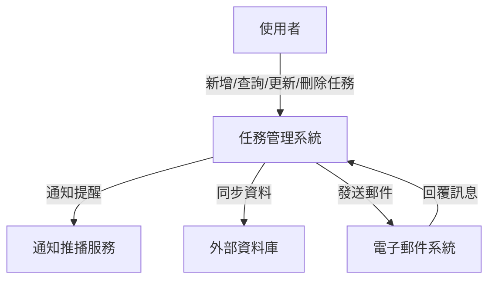
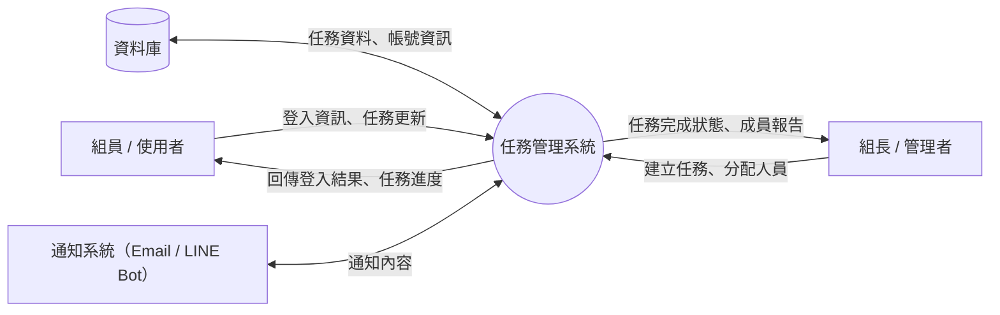

## 系統環境圖 (DFD)
### 一、System Context Diagram

```mermaid
flowchart TD
    %% 系統
    SYS[任務管理系統]

    %% 外部實體
    U[使用者] 
    E[電子郵件系統]
    N[通知推播服務]
    DB[外部資料庫]

    %% 系統與外部互動
    U -->|新增/查詢/更新/刪除任務| SYS
    SYS -->|通知提醒| N
    SYS -->|同步資料| DB
    SYS -->|發送郵件| E
    E -->|回覆訊息| SYS
```

```mermaid
flowchart LR
    %% === 外部實體 ===
    A[組員 / 使用者] -->|登入資訊、任務更新| B((任務管理系統))
    B -->|回傳登入結果、任務進度| A

    C[組長 / 管理者] -->|建立任務、分配人員| B
    B -->|任務完成狀態、成員報告| C

    D[(資料庫)] <-->|任務資料、帳號資訊| B

    E[通知系統（Email / LINE Bot）] <-->|通知內容| B
```

---
### 二、DFD Level 0
