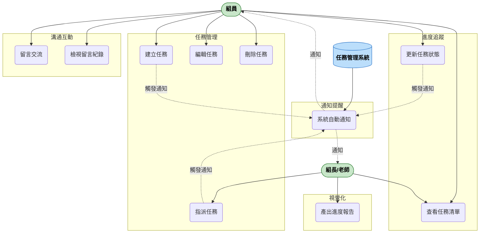

## 任務管理系統 功能性需求與非功能性需求

### 一、功能性需求 (Functional Requirements)
#### 1. 用戶註冊與登入
* 系統必須允許新用戶創建帳號或以現有帳號登入
* 用戶需提供使用者名稱、電子郵件與密碼進行註冊
* 系統應驗證電子郵件的有效性

#### 2. 任務建立與分配
* 系統必須允許用戶建立新任務，包含任務名稱、負責人、截止日期及描述
* 組長可將任務分配給指定成員
* 系統應允許用戶編輯或刪除所屬任務

#### 3. 任務進度追蹤
* 用戶應能更新任務狀態（如：未開始、進行中、已完成）
* 系統應自動記錄任務更新的時間與人員
* 系統應提供任務進度總覽頁面，顯示各任務的狀態

#### 4. 通知與提醒
* 系統應在任務截止前發送提醒通知給相關負責人
* 當任務被更新或留言時，相關人員應收到即時通知

#### 5. 留言與協作
* 系統必須提供留言功能，允許組員在任務下留言討論
* 用戶應能回覆、標註其他成員，並查看留言紀錄

#### 6. 任務視覺化與報告
* 系統應提供任務甘特圖或看板視覺化介面
* 系統應能自動生成任務進度報告，供組長或老師查看

---
### 二、非功能性需求 (Non-Functional Requirements)
#### 1. 性能
* 系統應在3秒內完成主要頁面載入
* 系統應能同時支援至少500名並發使用者
* 任務查詢功能應在1秒內返回結果

#### 2. 安全性
* 所有密碼需以SHA-256演算法加密儲存
* 系統必須使用HTTPS進行資料傳輸加密
* 系統應防範SQL注入與跨站腳本攻擊 (XSS)

#### 3. 可用性
* 系統可用率應達99.9%
* 系統介面應支援Chrome、Firefox、Safari與Edge最新版本
* 系統介面應符合WCAG 2.1 AA級無障礙標準

#### 4. 可擴展性
* 系統架構應支援橫向擴展以應對使用者成長
* 資料庫設計需能支撐未來五年內資料量成長

#### 5. 可維護性
* 程式碼應遵循標準化命名與格式規範
* 系統應提供錯誤日誌功能以便除錯與維護
* 系統應支援熱更新，不須停機即可部署小型修正

---
### 三、功能分解圖(functional decomposition diagram, FDD)

```mermaid
graph TD
    A[小組任務管理系統]

    A --> B1[1. 使用者管理]
    B1 --> B11[1.1 使用者註冊]
    B1 --> B12[1.2 使用者登入]
    B1 --> B13[1.3 權限控管]

    A --> B2[2. 任務管理]
    B2 --> B21[2.1 任務建立]
    B2 --> B22[2.2 任務分配]
    B2 --> B23[2.3 任務進度更新]
    B2 --> B24[2.4 任務查詢與排序]

    A --> B3[3. 小組進度追蹤]
    B3 --> B31[3.1 進度儀表板]
    B3 --> B32[3.2 任務統計報表]
    B3 --> B33[3.3 任務提醒通知]

    A --> B4[4. 通訊與協作功能]
    B4 --> B41[4.1 任務留言板]
    B4 --> B42[4.2 系統公告]

    A --> B5[5. 系統管理與維護]
    B5 --> B51[5.1 小組與帳號管理]
    B5 --> B52[5.2 系統安全與備份]
    B5 --> B53[5.3 日誌與錯誤追蹤]

    %% ---- 節點配色 ----
    style A fill:#d7b6f6,stroke:#a678d3,stroke-width:2px,color:#000,font-weight:bold
    style B1 fill:#fff3c4,stroke:#c2a83e,stroke-width:1px
    style B2 fill:#fff3c4,stroke:#c2a83e,stroke-width:1px
    style B3 fill:#fff3c4,stroke:#c2a83e,stroke-width:1px
    style B4 fill:#fff3c4,stroke:#c2a83e,stroke-width:1px
    style B5 fill:#fff3c4,stroke:#c2a83e,stroke-width:1px

    style B11 fill:#ffffff,stroke:#bcbcbc
    style B12 fill:#ffffff,stroke:#bcbcbc
    style B13 fill:#ffffff,stroke:#bcbcbc

    style B21 fill:#ffffff,stroke:#bcbcbc
    style B22 fill:#ffffff,stroke:#bcbcbc
    style B23 fill:#ffffff,stroke:#bcbcbc
    style B24 fill:#ffffff,stroke:#bcbcbc

    style B31 fill:#ffffff,stroke:#bcbcbc
    style B32 fill:#ffffff,stroke:#bcbcbc
    style B33 fill:#ffffff,stroke:#bcbcbc

    style B41 fill:#ffffff,stroke:#bcbcbc
    style B42 fill:#ffffff,stroke:#bcbcbc

    style B51 fill:#ffffff,stroke:#bcbcbc
    style B52 fill:#ffffff,stroke:#bcbcbc
    style B53 fill:#ffffff,stroke:#bcbcbc
```

---
### 四、使用案例
* 使用案例圖

* 使用案例說明
  #### 使用案例 1：建立任務(Create Task）
  | **項目** | **內容** |
  | :-- | :-- |
  | 主要角色 | 小組成員（User） |
  | 目標 | 建立新的任務以記錄待辦事項 |
  | 前置條件 | 1. 使用者已登入系統 2. 使用者屬於某個專案或小組 |
  | 主要流程 | 1. 使用者點選「新增任務」按鈕 2. 系統顯示任務輸入介面 3. 使用者輸入任務名稱、說明、負責人與截止日期 4. 使用者按下「儲存」 5. 系統建立任務並顯示於任務清單中 |
  | 替代流程 | 若使用者未填寫必填欄位，系統提示「請完整填寫資料」 |
  | 後置條件 | 新任務成功儲存並可在清單中顯示。 |

  #### 使用案例 2：更新任務進度（Update Task Progress）
  | **項目** | **內容** |
  | :-- | :-- |
  | 主要角色 | 任務負責人（Assignee） |
  | 目標 | 更新任務狀態或進度百分比 |
  | 前置條件 | 任務已存在且由該使用者負責 |
  | 主要流程 | 1. 使用者於任務清單中選擇要更新的任務  2. 系統顯示任務詳細資料  3. 使用者修改任務狀態（例如「進行中」、「已完成」）或輸入進度百分比  4. 按下「更新」。 5. 系統儲存修改並即時更新顯示 |
  | 替代流程 | 若使用者權限不足（非負責人），系統顯示「無法修改此任務」 |
  | 後置條件 | 任務狀態已更新，並同步顯示於所有成員的畫面 |

  #### 使用案例 3：留言與提醒（Post Comment & Notification）
  | **項目** | **內容** |
  | :-- | :-- |
  | 主要角色 | 小組成員（User） |
  | 目標 | 對任務留言並通知相關成員 |
  | 前置條件 | 任務存在且可被該使用者存取 |
  | 主要流程 | 1. 使用者在任務詳細頁面輸入留言內容 2. 按下「發佈」 3. 系統儲存留言並自動發送提醒給相關人員（例如負責人或組長） |
  | 替代流程 | 若留言內容為空，系統提示「留言不得為空」 |
  | 後置條件 | 1. 留言被成功儲存並顯示於任務留言區 2. 組內其他相關成員收到通知 |

  #### 

  

