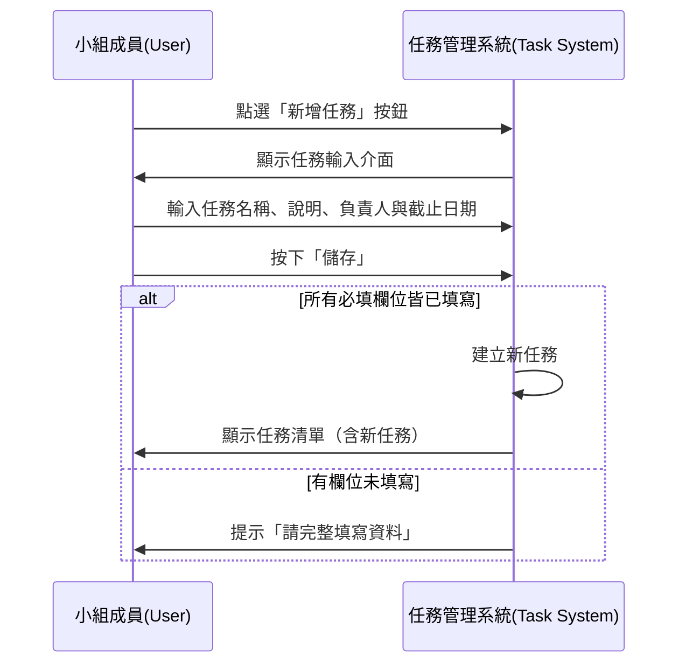
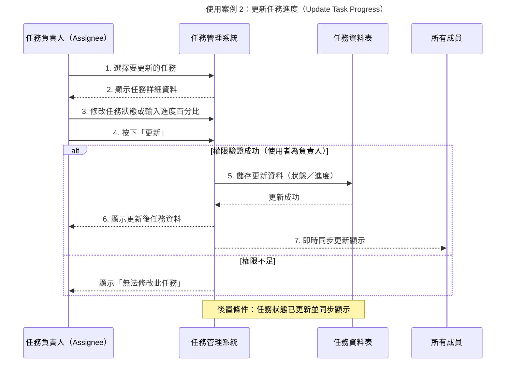
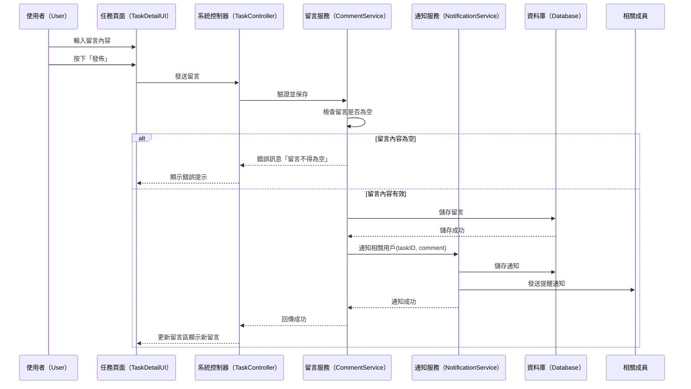

## UML類別圖

## 使用案例1：建立任務 UML循序圖

```mermaid
sequenceDiagram
    participant 使用者 as 小組成員(User)
    participant 系統 as 任務管理系統(Task System)

    使用者->>系統: 點選「新增任務」按鈕
    系統->>使用者: 顯示任務輸入介面
    使用者->>系統: 輸入任務名稱、說明、負責人與截止日期
    使用者->>系統: 按下「儲存」
    alt 所有必填欄位皆已填寫
        系統->>系統: 建立新任務
        系統->>使用者: 顯示任務清單（含新任務）
    else 有欄位未填寫
        系統->>使用者: 提示「請完整填寫資料」
    end
```

## 使用案例2：更新任務進度 UML循序圖

```mermaid
sequenceDiagram
    title 使用案例 2：更新任務進度（Update Task Progress）

    participant 使用者 as 任務負責人（Assignee）
    participant 系統 as 任務管理系統
    participant 任務資料庫 as 任務資料表

    使用者->>系統: 1. 選擇要更新的任務
    系統-->>使用者: 2. 顯示任務詳細資料

    使用者->>系統: 3. 修改任務狀態或輸入進度百分比
    使用者->>系統: 4. 按下「更新」

    alt 權限驗證成功（使用者為負責人）
        系統->>任務資料庫: 5. 儲存更新資料（狀態／進度）
        任務資料庫-->>系統: 更新成功
        系統-->>使用者: 6. 顯示更新後任務資料
        系統-->>所有成員: 7. 即時同步更新顯示
    else 權限不足
        系統-->>使用者: 顯示「無法修改此任務」
    end

    note over 系統,任務資料庫: 後置條件：任務狀態已更新並同步顯示
```

## 使用案例3：留言與提醒 UML循序圖

```mermaid
sequenceDiagram
    participant U as 使用者（User）
    participant UI as 任務頁面（TaskDetailUI）
    participant C as 系統控制器（TaskController）
    participant CS as 留言服務（CommentService）
    participant NS as 通知服務（NotificationService）
    participant DB as 資料庫（Database）

    %% --- 主要流程 ---
    U ->> UI: 輸入留言內容
    U ->> UI: 按下「發佈」
    UI ->> C: 發送留言
    C ->> CS: 驗證並保存
    CS ->> CS: 檢查留言是否為空

    alt 留言內容為空
        CS -->> C: 錯誤訊息「留言不得為空」
        C -->> UI: 顯示錯誤提示
    else 留言內容有效
        CS ->> DB: 儲存留言
        DB -->> CS: 儲存成功
        CS ->> NS: 通知相關用戶(taskID, comment)
        NS ->> DB: 儲存通知
        NS ->> 相關成員: 發送提醒通知
        NS -->> CS: 通知成功
        CS -->> C: 回傳成功
        C -->> UI: 更新留言區顯示新留言
    end
```
