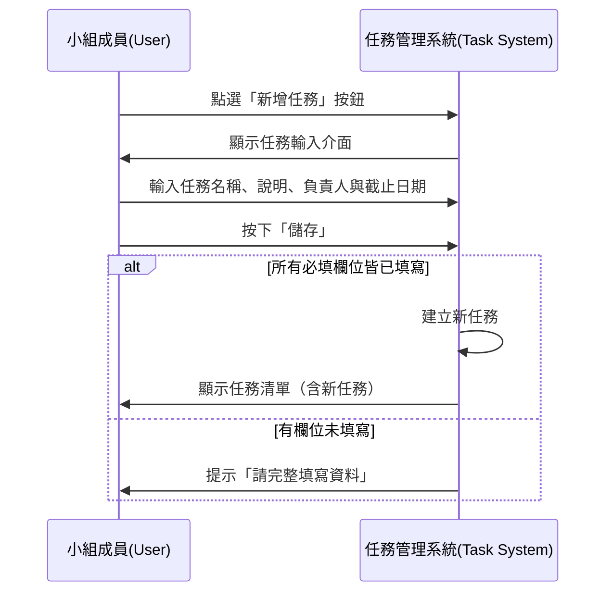
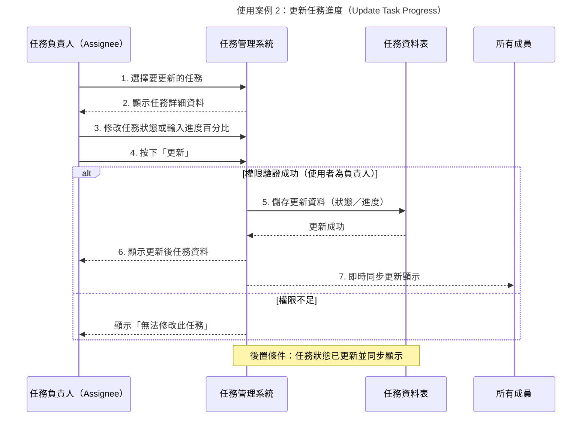

## UML類別圖


## 📝 使用案例1：建立任務（Create Task）UML循序圖


```mermaid
sequenceDiagram
    participant 使用者 as 小組成員(User)
    participant 系統 as 任務管理系統(Task System)

    使用者->>系統: 點選「新增任務」按鈕
    系統->>使用者: 顯示任務輸入介面
    使用者->>系統: 輸入任務名稱、說明、負責人與截止日期
    使用者->>系統: 按下「儲存」
    alt 所有必填欄位皆已填寫
        系統->>系統: 建立新任務
        系統->>使用者: 顯示任務清單（含新任務）
    else 有欄位未填寫
        系統->>使用者: 提示「請完整填寫資料」
    end
```
-------



```mermaid
sequenceDiagram
    title 使用案例 2：更新任務進度（Update Task Progress）

    participant 使用者 as 任務負責人（Assignee）
    participant 系統 as 任務管理系統
    participant 任務資料庫 as 任務資料表

    使用者->>系統: 1. 選擇要更新的任務
    系統-->>使用者: 2. 顯示任務詳細資料

    使用者->>系統: 3. 修改任務狀態或輸入進度百分比
    使用者->>系統: 4. 按下「更新」

    alt 權限驗證成功（使用者為負責人）
        系統->>任務資料庫: 5. 儲存更新資料（狀態／進度）
        任務資料庫-->>系統: 更新成功
        系統-->>使用者: 6. 顯示更新後任務資料
        系統-->>所有成員: 7. 即時同步更新顯示
    else 權限不足
        系統-->>使用者: 顯示「無法修改此任務」
    end

    note over 系統,任務資料庫: 後置條件：任務狀態已更新並同步顯示
```

```
