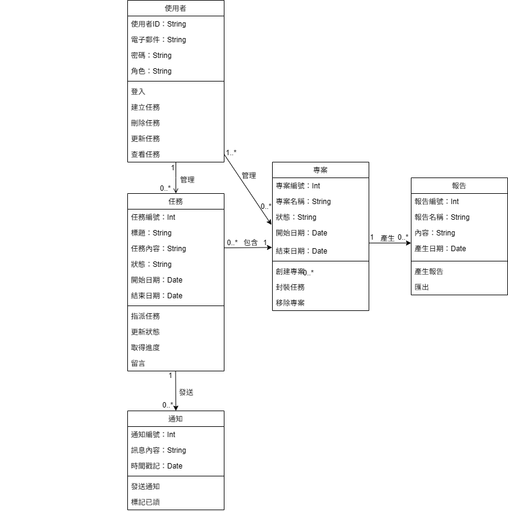
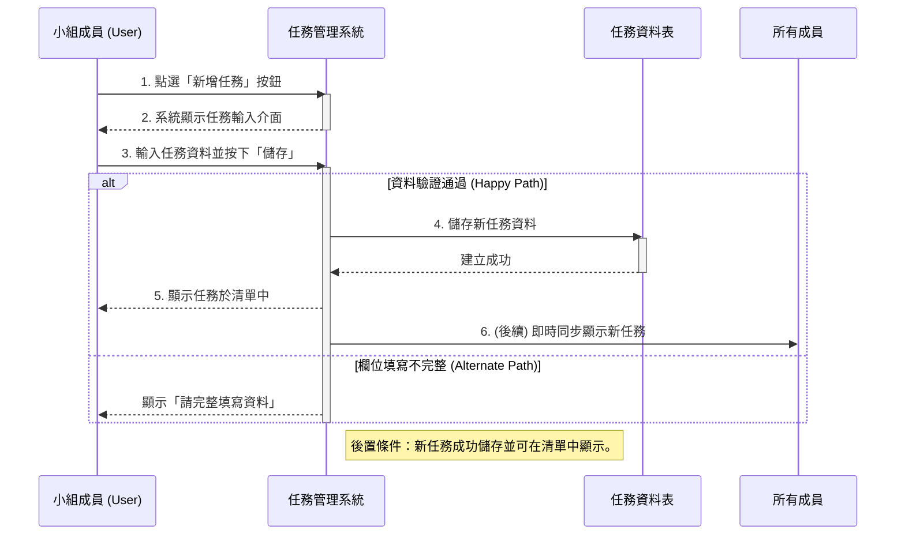
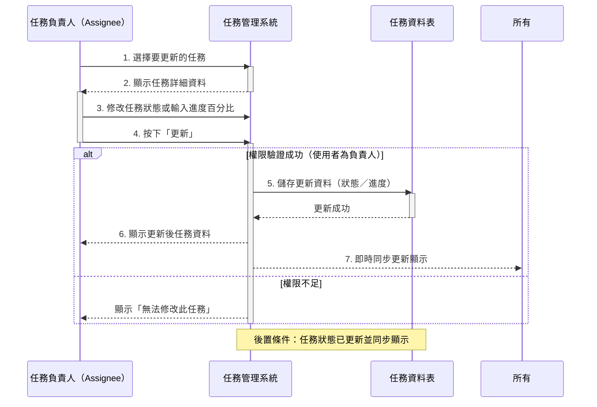
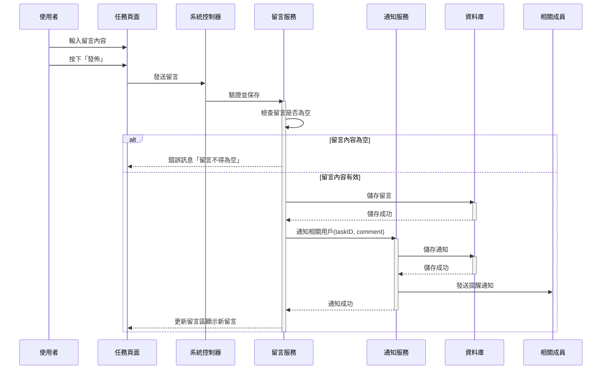
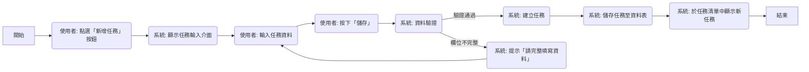
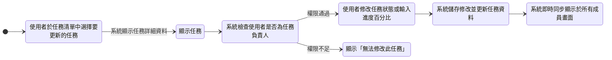
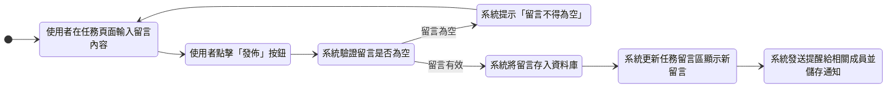

## UML類別圖

## 使用案例1：建立任務 UML循序圖

```mermaid
sequenceDiagram
  

    participant User as 小組成員 (User)
    participant System as 任務管理系統
    participant DB as 任務資料表
    participant Members as 所有成員

    %% 流程 1: 顯示介面
    User->>System: 1. 點選「新增任務」按鈕
    activate System
    System-->>User: 2. 系統顯示任務輸入介面
    deactivate System

    %% 流程 2: 儲存任務
    User->>System: 3. 輸入任務資料並按下「儲存」
    activate System

    %% 替代流程 (Alternate Flow)
    alt 資料驗證通過 (Happy Path)
        System->>DB: 4. 儲存新任務資料
        activate DB
        DB-->>System: 建立成功
        deactivate DB
        
        System-->>User: 5. 顯示任務於清單中
        System->>Members: 6. (後續) 即時同步顯示新任務
    else 欄位填寫不完整 (Alternate Path)
        System-->>User: 顯示「請完整填寫資料」
    end
    
    %% 在 alt 區塊結束後，才停用系統
    deactivate System

    Note right of System: 後置條件：新任務成功儲存並可在清單中顯示。
```
---

## 使用案例2：更新任務進度 UML循序圖

```mermaid
sequenceDiagram


    participant 使用者 as 任務負責人（Assignee）
    participant 系統 as 任務管理系統
    participant 任務資料庫 as 任務資料表

    %% 使用者選擇任務（使用者有焦點在互動）
    
    使用者->>系統: 1. 選擇要更新的任務
    

    %% 系統處理並顯示詳細（系統被聚焦）
    activate 系統
    系統-->>使用者: 2. 顯示任務詳細資料
    deactivate 系統

    %% 使用者修改並按下更新（使用者再次聚焦）
    activate 使用者
    使用者->>系統: 3. 修改任務狀態或輸入進度百分比
    使用者->>系統: 4. 按下「更新」
    deactivate 使用者

    %% 系統驗證權限並儲存（系統與資料庫產生焦點）
    activate 系統
    alt 權限驗證成功（使用者為負責人）
        系統->>任務資料庫: 5. 儲存更新資料（狀態／進度）
        activate 任務資料庫
        任務資料庫-->>系統: 更新成功
        deactivate 任務資料庫

        系統-->>使用者: 6. 顯示更新後任務資料
        %% 系統推送即時同步通知（系統維持焦點）
        系統-->>所有: 7. 即時同步更新顯示
    else 權限不足
        系統-->>使用者: 顯示「無法修改此任務」
    end
    deactivate 系統

    note over 系統,任務資料庫: 後置條件：任務狀態已更新並同步顯示
```
## 使用案例3：留言與提醒 UML循序圖

```mermaid
sequenceDiagram
    participant U as 使用者
    participant UI as 任務頁面
    participant C as 系統控制器
    participant CS as 留言服務
    participant NS as 通知服務
    participant DB as 資料庫

    %% --- 主要流程 ---
    
    U ->> UI: 輸入留言內容
    U ->> UI: 按下「發佈」
    UI ->> C: 發送留言
    C ->> CS: 驗證並保存
    
    activate CS
    CS ->> CS: 檢查留言是否為空

    alt 留言內容為空
        CS -->> UI: 錯誤訊息「留言不得為空」
    else 留言內容有效
        CS ->> DB: 儲存留言
        activate DB
        DB -->> CS: 儲存成功
        deactivate DB

        CS ->> NS: 通知相關用戶(taskID, comment)
        activate NS
        NS ->> DB: 儲存通知
        activate DB
        DB -->> NS: 儲存成功
        deactivate DB

        NS ->> 相關成員: 發送提醒通知
        NS -->> CS: 通知成功
        deactivate NS

        CS -->> UI: 更新留言區顯示新留言
    end
    deactivate CS
```

## 使用案例1：建立任務 UML活動圖

```mermaid
graph LR
    A[開始] --> B(使用者: 點選「新增任務」按鈕);
    B --> C(系統: 顯示任務輸入介面);
    C --> D(使用者: 輸入任務資料);
    D --> E(使用者: 按下「儲存」);
    E --> F(系統: 資料驗證);
    F -- 驗證通過 --> G(系統: 建立任務);
    G --> H(系統: 儲存任務至資料表);
    H --> I(系統: 於任務清單中顯示新任務);
    I --> L[結束];
    F -- 欄位不完整 --> J(系統: 提示「請完整填寫資料」);
    J --> D;
```
----

## 使用案例2：更新任務進度 UML活動圖

```mermaid
stateDiagram-v2
direction LR
    [*] --> 選擇任務
    選擇任務: 使用者於任務清單中選擇要更新的任務
    選擇任務 --> 顯示任務: 系統顯示任務詳細資料

    顯示任務 --> 驗證身份
    驗證身份: 系統檢查使用者是否為任務負責人

    驗證身份 --> 修改任務: 權限通過
    驗證身份 --> 顯示錯誤: 權限不足

    修改任務: 使用者修改任務狀態或輸入進度百分比
    修改任務 --> 儲存任務
    儲存任務: 系統儲存修改並更新任務資料
    儲存任務 --> 同步更新
    同步更新: 系統即時同步顯示於所有成員畫面

    顯示錯誤: 顯示「無法修改此任務」
```

## 使用案例3：留言與提醒 UML活動圖

```mermaid
stateDiagram-v2
direction LR

    [*] --> 輸入留言
    輸入留言: 使用者在任務頁面輸入留言內容

    輸入留言 --> 按下發佈
    按下發佈: 使用者點擊「發佈」按鈕

    按下發佈 --> 系統檢查留言
    系統檢查留言: 系統驗證留言是否為空

    系統檢查留言 --> 顯示錯誤: 留言為空
    顯示錯誤: 系統提示「留言不得為空」
    顯示錯誤 --> 輸入留言

    系統檢查留言 --> 儲存留言: 留言有效
    儲存留言: 系統將留言存入資料庫

    儲存留言 --> 更新留言區
    更新留言區: 系統更新任務留言區顯示新留言

    更新留言區 --> 通知相關成員
    通知相關成員: 系統發送提醒給相關成員並儲存通知
```
