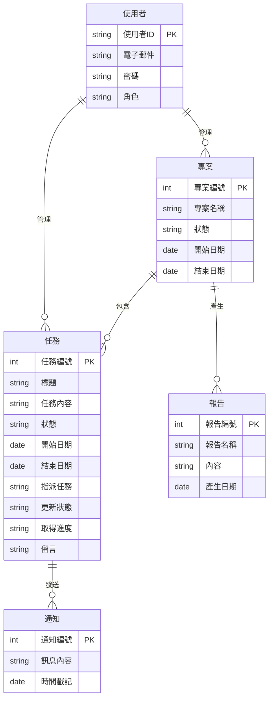

## ERD

```mermaid
erDiagram

    使用者 {
        string 使用者ID PK
        string 電子郵件
        string 密碼
        string 角色
    }

    專案 {
        int 專案編號 PK
        string 專案名稱
        string 狀態
        date 開始日期
        date 結束日期
    }

    任務 {
        int 任務編號 PK
        string 標題
        string 任務內容
        string 狀態
        date 開始日期
        date 結束日期
        string 指派任務
        string 更新狀態
        string 取得進度
        string 留言
    }

    通知 {
        int 通知編號 PK
        string 訊息內容
        date 時間戳記
    }

    報告 {
        int 報告編號 PK
        string 報告名稱
        string 內容
        date 產生日期
    }

    使用者 ||--o{ 專案 : "管理"
    專案 ||--o{ 任務 : "包含"
    使用者 ||--o{ 任務 : "管理"
    任務 ||--o{ 通知 : "發送"
    專案 ||--o{ 報告 : "產生"
```
