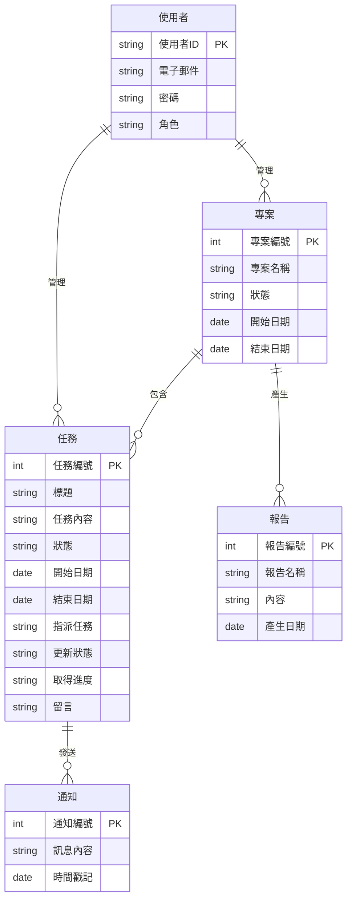
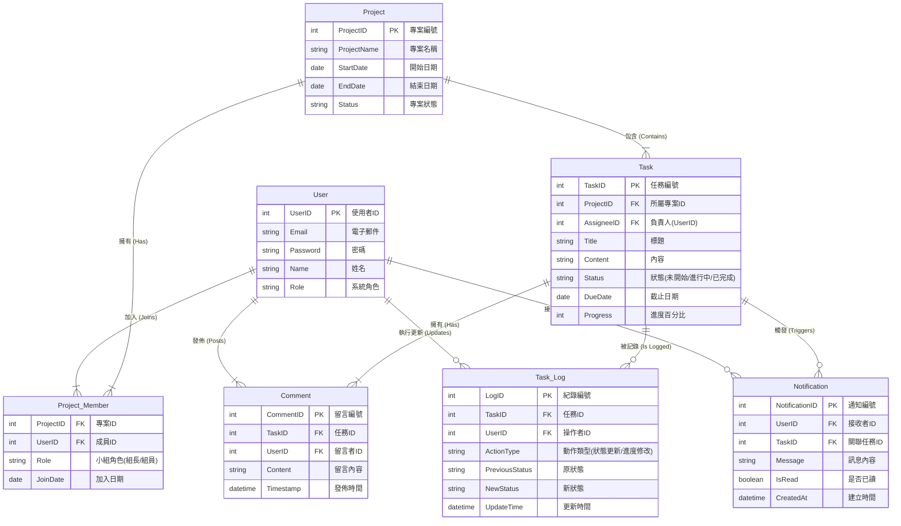

## ERD

```mermaid
erDiagram

    使用者 {
        string 使用者ID PK
        string 電子郵件
        string 密碼
        string 角色
    }

    專案 {
        int 專案編號 PK
        string 專案名稱
        string 狀態
        date 開始日期
        date 結束日期
    }

    任務 {
        int 任務編號 PK
        string 標題
        string 任務內容
        string 狀態
        date 開始日期
        date 結束日期
        string 指派任務
        string 更新狀態
        string 取得進度
        string 留言
    }

    通知 {
        int 通知編號 PK
        string 訊息內容
        date 時間戳記
    }

    報告 {
        int 報告編號 PK
        string 報告名稱
        string 內容
        date 產生日期
    }

    使用者 ||--o{ 專案 : "管理"
    專案 ||--o{ 任務 : "包含"
    使用者 ||--o{ 任務 : "管理"
    任務 ||--o{ 通知 : "發送"
    專案 ||--o{ 報告 : "產生"
```

```mermaid
erDiagram
    %% 實體定義

    User ||--|{ Project_Member : "加入 (Joins)"
    User ||--|{ Comment : "發佈 (Posts)"
    User ||--o{ Task_Log : "執行更新 (Updates)"
    User ||--o{ Notification : "接收 (Receives)"
    
    Project ||--|{ Project_Member : "擁有 (Has)"
    Project ||--|{ Task : "包含 (Contains)"
    
    Task ||--|{ Comment : "擁有 (Has)"
    Task ||--o{ Task_Log : "被記錄 (Is Logged)"
    Task ||--o{ Notification : "觸發 (Triggers)"

    %% 1. 實體詳細屬性
    User {
        int UserID PK "使用者ID"
        string Email "電子郵件"
        string Password "密碼"
        string Name "姓名"
        string Role "系統角色"
    }

    Project {
        int ProjectID PK "專案編號"
        string ProjectName "專案名稱"
        date StartDate "開始日期"
        date EndDate "結束日期"
        string Status "專案狀態"
    }

    Task {
        int TaskID PK "任務編號"
        int ProjectID FK "所屬專案ID"
        int AssigneeID FK "負責人(UserID)"
        string Title "標題"
        string Content "內容"
        string Status "狀態(未開始/進行中/已完成)"
        date DueDate "截止日期"
        int Progress "進度百分比"
    }

    Comment {
        int CommentID PK "留言編號"
        int TaskID FK "任務ID"
        int UserID FK "留言者ID"
        string Content "留言內容"
        datetime Timestamp "發佈時間"
    }

    Notification {
        int NotificationID PK "通知編號"
        int UserID FK "接收者ID"
        int TaskID FK "關聯任務ID"
        string Message "訊息內容"
        boolean IsRead "是否已讀"
        datetime CreatedAt "建立時間"
    }

    %% 2. 組合實體 (Composite Entities)
    Project_Member {
        int ProjectID FK "專案ID"
        int UserID FK "成員ID"
        string Role "小組角色(組長/組員)"
        date JoinDate "加入日期"
    }

    Task_Log {
        int LogID PK "紀錄編號"
        int TaskID FK "任務ID"
        int UserID FK "操作者ID"
        string ActionType "動作類型(狀態更新/進度修改)"
        string PreviousStatus "原狀態"
        string NewStatus "新狀態"
        datetime UpdateTime "更新時間"
    }
```
