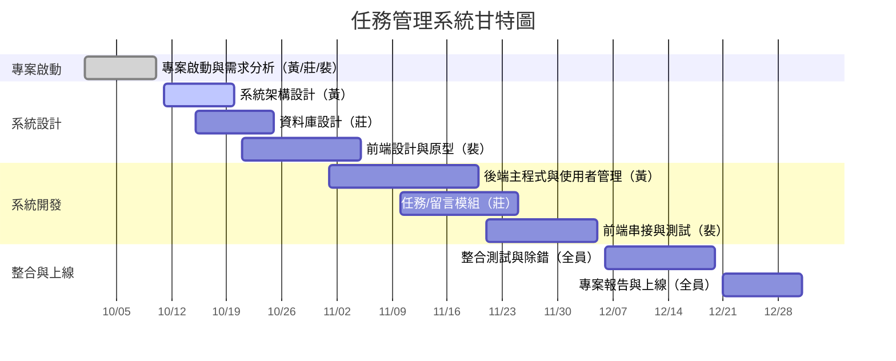

```mermaid
gantt
    title 任務管理系統甘特圖
    dateFormat  YYYY-MM-DD
    axisFormat  %m/%d

    section 專案啟動
    專案啟動與需求分析（黃/莊/裴） :done, 2025-10-01, 2025-10-10

    section 系統設計
    系統架構設計（黃） :active, 2025-10-11, 2025-10-20
    資料庫設計（莊） : 2025-10-15, 2025-10-25
    前端設計與原型（裴） : 2025-10-21, 2025-11-05

    section 系統開發
    後端主程式與使用者管理（黃） : 2025-11-01, 2025-11-20
    任務/留言模組（莊） : 2025-11-10, 2025-11-25
    前端串接與測試（裴） : 2025-11-21, 2025-12-05

    section 整合與上線
    整合測試與除錯（全員） : 2025-12-06, 2025-12-20
    專案報告與上線（全員） : 2025-12-21, 2025-12-31
```

