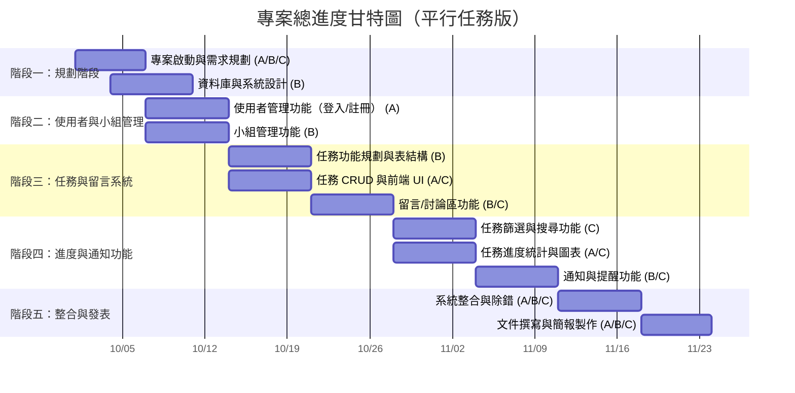

## 1

| ID    | 任務名稱             | 負責人       | 持續時間 (天) | 開始日期      | 結束日期      | 前置任務  |
| :---- | :--------------- | :-------- | :------- | :-------- | :-------- | :---- |
| **A** | **階段一：規劃階段**     | **全員**    | **13**   | **10/01** | **10/13** |       |
| A1    | 專案啟動與需求規劃        | 黃 / 莊 / 裴 | 6        | 10/01     | 10/06     |       |
| A2    | 資料庫與系統設計         | 莊         | 7        | 10/04     | 10/10     | A1    |
| **B** | **階段二：使用者與小組管理** | **全員**    | **14**   | **10/07** | **10/20** | **A** |
| B1    | 使用者管理功能（登入/註冊）   | 黃         | 7        | 10/07     | 10/13     | A2    |
| B2    | 小組管理功能           | 莊         | 7        | 10/07     | 10/13     | A2    |
| **C** | **階段三：任務與留言系統**  | **全員**    | **21**   | **10/14** | **11/03** | **B** |
| C1    | 任務功能規劃與表結構       | 莊         | 7        | 10/14     | 10/20     | B2    |
| C2    | 任務 CRUD 與前端 UI   | 黃 / 裴     | 7        | 10/14     | 10/20     | C1    |
| C3    | 留言/討論區功能         | 莊 / 裴     | 7        | 10/21     | 10/27     | C2    |
| **D** | **階段四：進度與通知功能**  | **全員**    | **21**   | **10/28** | **11/17** | **C** |
| D1    | 任務篩選與搜尋功能        | 裴         | 7        | 10/28     | 11/03     | C3    |
| D2    | 任務進度統計與圖表        | 黃 / 裴     | 7        | 10/28     | 11/03     | D1    |
| D3    | 通知與提醒功能          | 莊 / 裴     | 7        | 11/04     | 11/10     | D2    |
| **E** | **階段五：整合與發表**    | **全員**    | **13**   | **11/11** | **12/21** | **D** |
| E1    | 系統整合與除錯          | 黃 / 莊 / 裴 | 7        | 11/11     | 11/17     | D3    |
| E2    | 文件撰寫與簡報製作        | 黃 / 莊 / 裴 | 6        | 11/18     | 11/23     | E1    |

---
## 2

