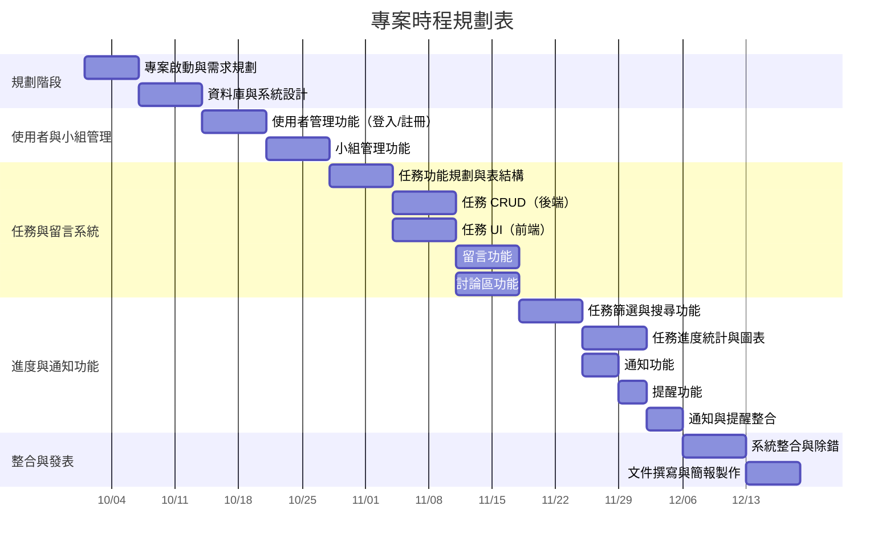

## 1

| ID    | 任務名稱             | 負責人       | 持續時間 (天) | 開始日期  | 結束日期  | 前置任務      | 分工角色         |
| :---- | :--------------- | :-------- | :------- | :---- | :---- | :-------- | :----------- |
| **A** | **階段一：規劃階段**     | **全員**    | **13**   | 10/01 | 10/13 |           | 全員規劃         |
| A1    | 專案啟動與需求規劃        | 黃 / 莊 / 裴 | 6        | 10/01 | 10/06 |           | 全員規劃         |
| A2    | 資料庫與系統設計         | 莊         | 7        | 10/07 | 10/13 | A1        | 資料邏輯設計       |
| **B** | **階段二：使用者與小組管理** | **全員**    | **14**   | 10/14 | 10/27 | A         | 全員協作         |
| B1    | 使用者管理功能（登入/註冊）   | 黃         | 7        | 10/14 | 10/20 | A2        | 系統架構 / 後端主程式 |
| B2    | 小組管理功能           | 莊         | 7        | 10/21 | 10/27 | B1        | 資料邏輯負責       |
| **C** | **階段三：任務與留言系統**  | **全員**    | **21**   | 10/28 | 11/17 | B         | 全員協作         |
| C1    | 任務功能規劃與表結構       | 莊         | 7        | 10/28 | 11/03 | B2        | 資料邏輯負責       |
| C2   | 任務 CRUD（後端）      | 黃         | 7        | 11/04 | 11/10 | C1        | 後端主程式        |
| C2   | 任務 UI（前端）        | 裴         | 7        | 11/04 | 11/10 | C1        | 前端介面設計與串接    |
| C3   | 留言功能             | 黃 / 裴     | 7        | 11/11 | 11/17 | C2a       | 後端主程式 / 前端介面 |
| C3   | 討論區功能            | 黃 / 裴     | 7        | 11/11 | 11/17 | C2b       | 後端主程式 / 前端介面 |
| **D** | **階段四：進度與通知功能**  | **全員**    | **21**   | 11/18 | 12/08 | C         | 全員協作         |
| D1    | 任務篩選與搜尋功能        | 裴         | 7        | 11/18 | 11/24 | C3a / C3b | 前端介面設計與串接    |
| D2    | 任務進度統計與圖表        | 黃 / 裴     | 7        | 11/25 | 12/01 | D1        | 後端主程式 / 前端介面 |
| D3   | 通知功能             | 莊         | 4        | 11/25 | 11/28 | D1        | 資料邏輯負責       |
| D3   | 提醒功能             | 裴         | 3        | 11/29 | 12/01 | D1        | 前端介面設計與串接    |
| D3   | 通知與提醒整合          | 黃 / 莊 / 裴 | 4        | 12/02 | 12/05 | D3a / D3b | 全員整合         |
| **E** | **階段五：整合與發表**    | **全員**    | **13**   | 12/06 | 12/18 | D3c       | 全員協作         |
| E1    | 系統整合與除錯          | 黃 / 莊 / 裴 | 7        | 12/06 | 12/12 | D3c       | 全員整合         |
| E2    | 文件撰寫與簡報製作        | 黃 / 莊 / 裴 | 6        | 12/13 | 12/18 | E1        | 全員撰寫與製作      |


---
## 2


```

